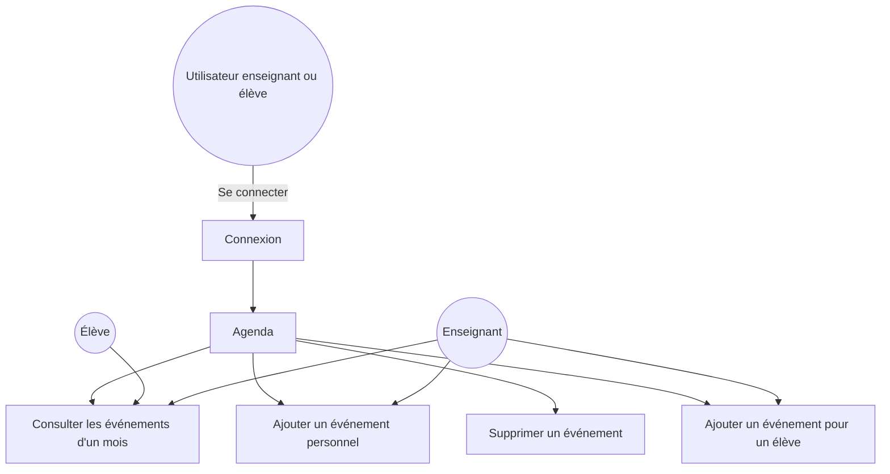

```mermaid
graph TD
Utilisateur((Utilisateur enseignant ou élève)) -->|Se connecter| Connexion[Connexion]
Connexion --> Agenda[Agenda]

    Agenda --> Consulter[Consulter les événements d'un mois]
    Agenda --> AjouterPerso[Ajouter un événement personnel]
    Agenda --> Supprimer[Supprimer un événement]
    Agenda --> AjouterEleve[Ajouter un événement pour un élève]

    Eleve((Élève)) --> Consulter
    Enseignant((Enseignant)) --> AjouterPerso
    Enseignant --> AjouterEleve
    Enseignant --> Consulter
```
