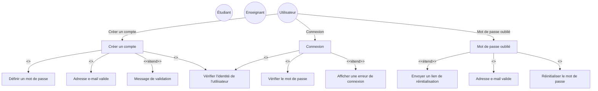

```mermaid
%% Diagramme de cas d'utilisation pour la connexion
graph TD
Etudiant((Étudiant))
Enseignant((Enseignant))
Utilisateur((Utilisateur)) -->|"Créer un compte"| CreerCompte[Créer un compte]
CreerCompte -->|"<<inclut>>"| DefinirMDP[Définir un mot de passe]
CreerCompte -->|"<<inclut>>"| EmailValide[Adresse e-mail valide]
CreerCompte -->|"<<étend>>"| MessageValidation[Message de validation]
CreerCompte -->|"<<inclut>>"| VerifierIdentite[Vérifier l'identité de l'utilisateur]

    Utilisateur -->|"Connexion"| Connexion[Connexion]
    Connexion -->|"<<inclut>>"| VerifierMDP[Vérifier le mot de passe]
    Connexion -->|"<<inclut>>"| VerifierIdentite
    Connexion -->|"<<étend>>"| AfficherErreur[Afficher une erreur de connexion]

    Utilisateur -->|"Mot de passe oublié"| MdpOublie[Mot de passe oublié]
    MdpOublie -->|"<<étend>>"| EnvoyerLien[Envoyer un lien de réinitialisation]
    MdpOublie -->|"<<inclut>>"| VerifierEmail[Adresse e-mail valide]
    MdpOublie -->|"<<inclut>>"| ReinitialiserMDP[Réinitialiser le mot de passe]
```
