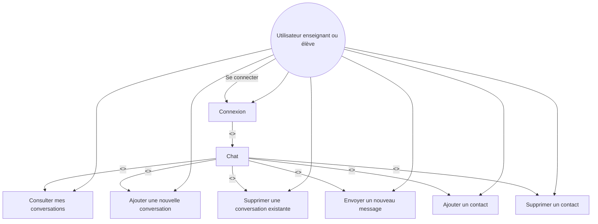

```mermaid
graph TD
Utilisateur((Utilisateur enseignant ou élève)) -->|Se connecter| Connexion[Connexion]
Connexion -->|<<include>>| Chat[Chat]

    Chat -->|<<include>>| Consulter[Consulter mes conversations]
    Chat -->|<<include>>| Ajouter[Ajouter une nouvelle conversation]
    Chat -->|<<include>>| Supprimer[Supprimer une conversation existante]
    Chat -->|<<include>>| Envoyer[Envoyer un nouveau message]
    Chat -->|<<include>>| AjouterContact[Ajouter un contact]
    	Chat -->|<<include>>| SupprimerContact[Supprimer un contact]

    Utilisateur --> Connexion
    Utilisateur --> Consulter
    Utilisateur --> Ajouter
    Utilisateur --> Supprimer
    Utilisateur --> Envoyer
    Utilisateur --> AjouterContact
    	Utilisateur --> SupprimerContact

```
